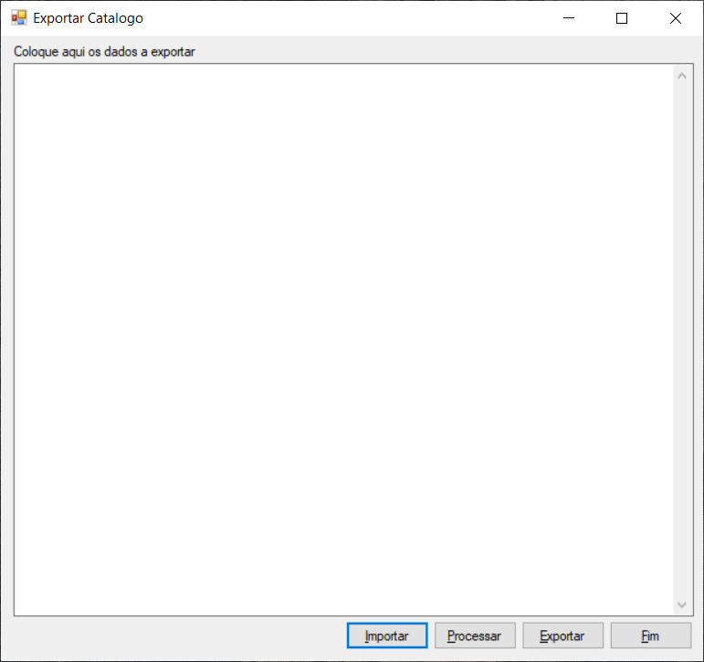
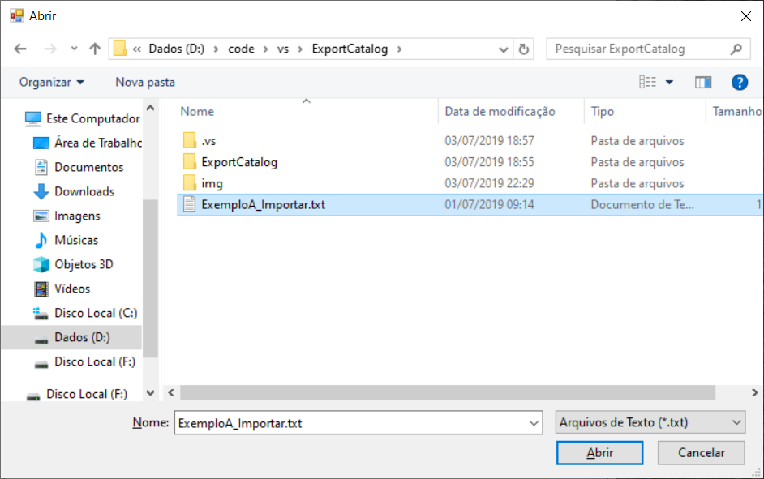
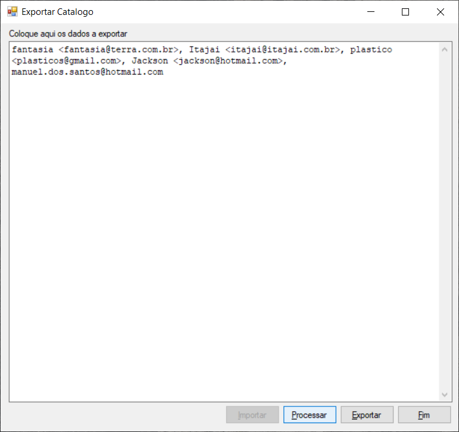
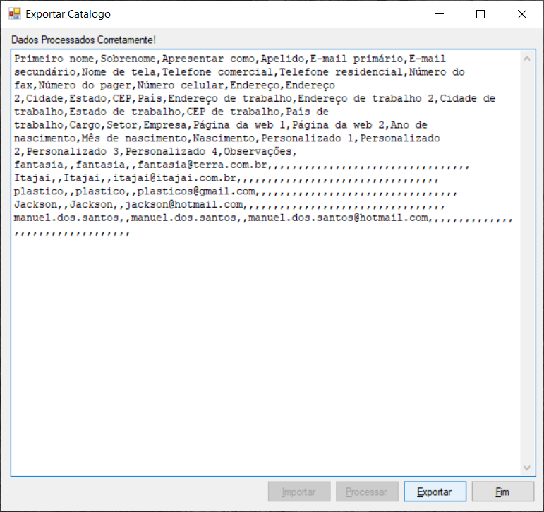
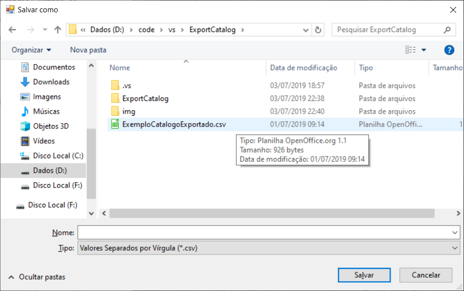
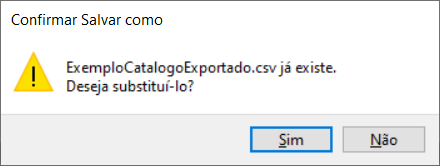

# ExportCatalog


***```Programa GNU GPL```*** que facilita a importação de arquivos "copiados do cabeçalho de um web-mail" para criar um catálogo de endereços no Thunderbird.  
> Atualizado para Visual C# 2019 Community com Framework 4.5.2.

* ***```Importe ou "cole" os dados```*** tem um exemplo dos dados que processam corretamente no arquivo 'ExemploA_Importar.txt'.  

* ***```Processar```*** quando os dados já estiverem no programa (na tela) pode usar o botão Processar para que os mesmo sejam transformados.  

* ***```Exportar```*** após Processar os dados, o formato já estara pronto para exportar a um arquivo csv (usando este botão).  

* ***```Fim```*** naturalmente encerra o programa.  

* ***```ExemploCatalogoExportado.csv```*** este arquivo comtêm um exemplo de como ficam os dados exactamente (usando o 'ExemploA_Importar.txt').  

* ***```Telas do programa```***

Tela Inicial



Tela de Importação



Tela de Dados a Processar



Tela de Dados já Processados



Tela de Exportação



Tela de Confirmação



